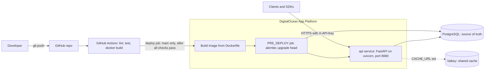
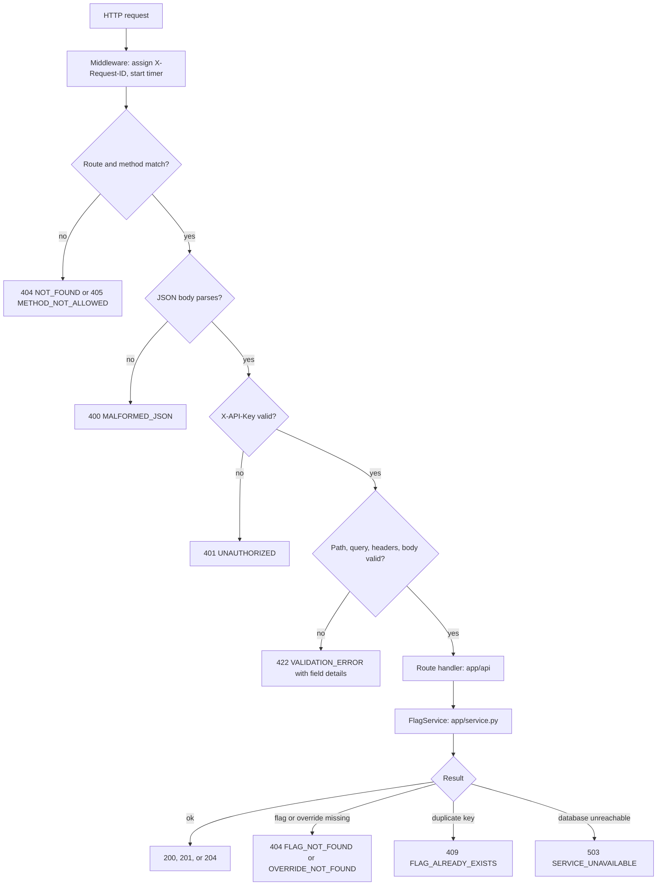
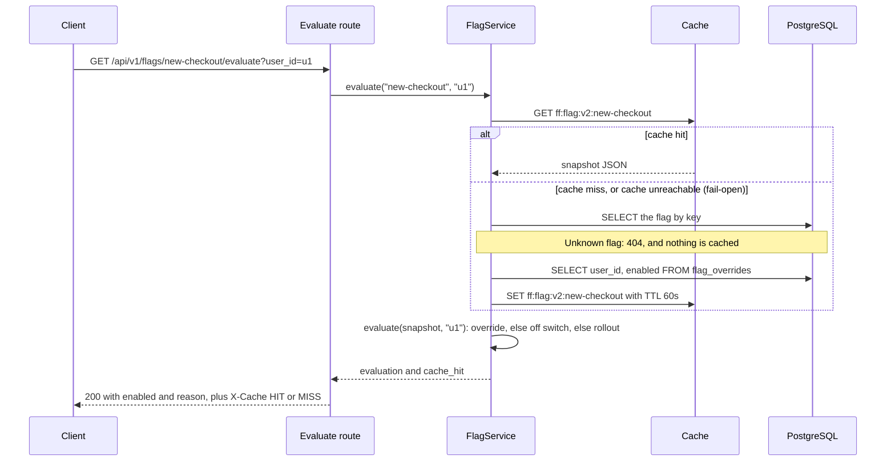
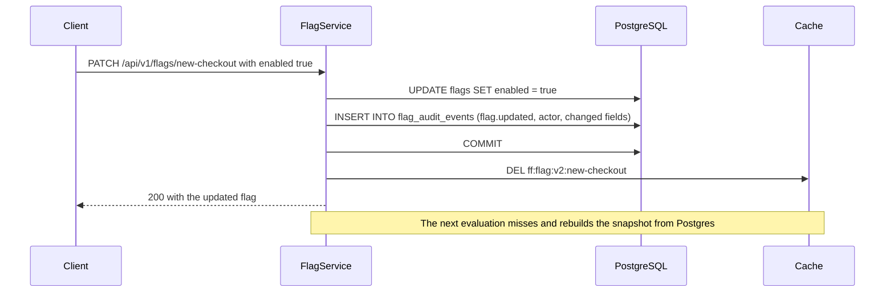

# Architecture

Four views of the service: how it's deployed, what happens to every request, how an evaluation is served (the hot path), and how writes record an audit event and keep the cache correct.

## 1. System and deployment



- **Postgres** is the source of truth for flags, overrides, and the audit log. Schema changes ship as Alembic migrations, run by a `PRE_DEPLOY` job before new code takes traffic.
- **Valkey** is optional. With `CACHE_URL` unset, each process uses its own in-memory cache, which is only correct with a single instance.
- **App Platform** routes traffic only to instances whose health check passes, and replaces instances one at a time on deploy.

## 2. Request lifecycle

The order of checks below was verified against the running container: an unknown route is 404 even without an API key, malformed JSON is 400 before the key is checked, and a missing key is 401 before field validation. The `X-Actor` header, added later, is validated in the same step as the path, query, and body; a test checks that a missing key is still a 401 first.



Every response, success or error, passes back through the middleware, which adds the `X-Request-ID` header and writes one JSON log line (method, path, status, duration, request ID). Errors all use one envelope, built in `app/errors.py`:

```json
{"error": {"code": "FLAG_NOT_FOUND", "message": "Flag 'x' does not exist", "details": null, "request_id": "..."}}
```

## 3. Evaluation read path (cache-aside)



- The cached unit is the whole flag (global state, rollout percentage, and its overrides), so one entry serves every user of that flag. Evaluation itself is a pure function in `app/evaluation.py`.
- `evaluate()` applies a fixed precedence. The user's override wins (`USER_OVERRIDE`). Otherwise a disabled flag is off (`GLOBAL`), and an enabled flag at a 100% rollout is on (`GLOBAL`). Otherwise the flag is on only when the user's bucket is below the rollout percentage (`ROLLOUT`). The bucket is `sha256("{flag_key}:{user_id}")` reduced to 0-99, so it needs no stored state and every instance computes the same answer.
- The `v2` in the key is the snapshot format's version. It changes whenever the snapshot's fields change, so instances running different releases during a deploy never read each other's snapshots.
- If the cache is down, reads fall through to Postgres after at most 0.5s (no retries), so a cache outage costs latency, not errors.
- `GET /api/v1/users/{user_id}/flags` (every flag for one user) skips the cache: it's one `LEFT JOIN` query from flags to that user's overrides, fed through the same `evaluate()` function.

## 4. Write path and invalidation



- Every write adds its audit event in the same transaction, before the `COMMIT`, so the change and its event are committed or rolled back together. A rejected write (409 or 404) leaves no event, and if the audit `INSERT` fails, the change is rolled back and the request returns 500.
- Every write (create, update, delete, override set or removed) commits first and deletes the flag's snapshot second. Deleting before the commit would let a concurrent read re-cache the old row.
- One rarer race remains: a read that loaded the old row before the commit can write it to the cache just after the delete. The TTL (60s by default) caps how long that stale entry can live. The same TTL covers a failed `DEL` during a cache outage.
- Deleting a flag cascades to its overrides in Postgres (`ON DELETE CASCADE`) and removes its snapshot, so re-creating a flag with the same key starts clean. Its audit events stay: they reference the flag by key, not by a foreign key, so a re-created flag's history continues the old one.
